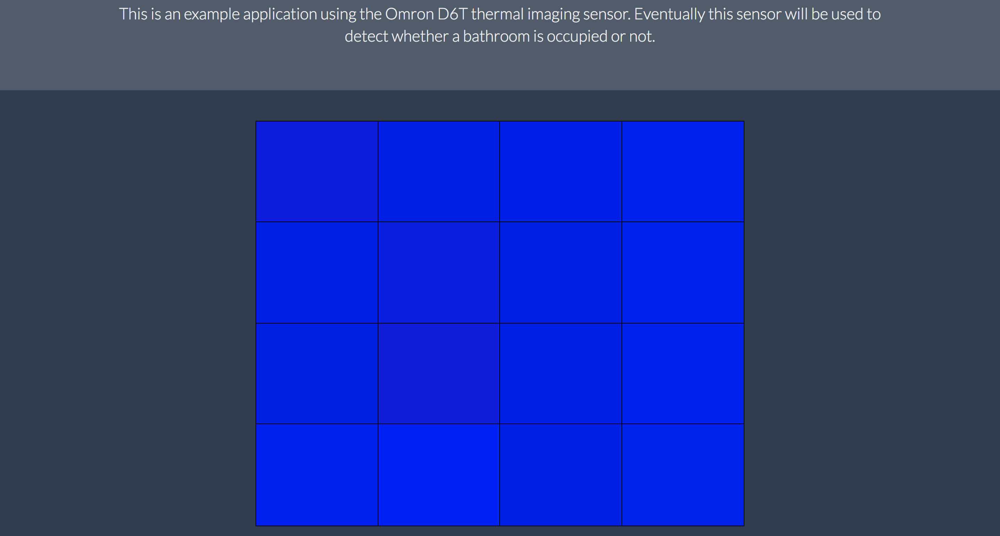
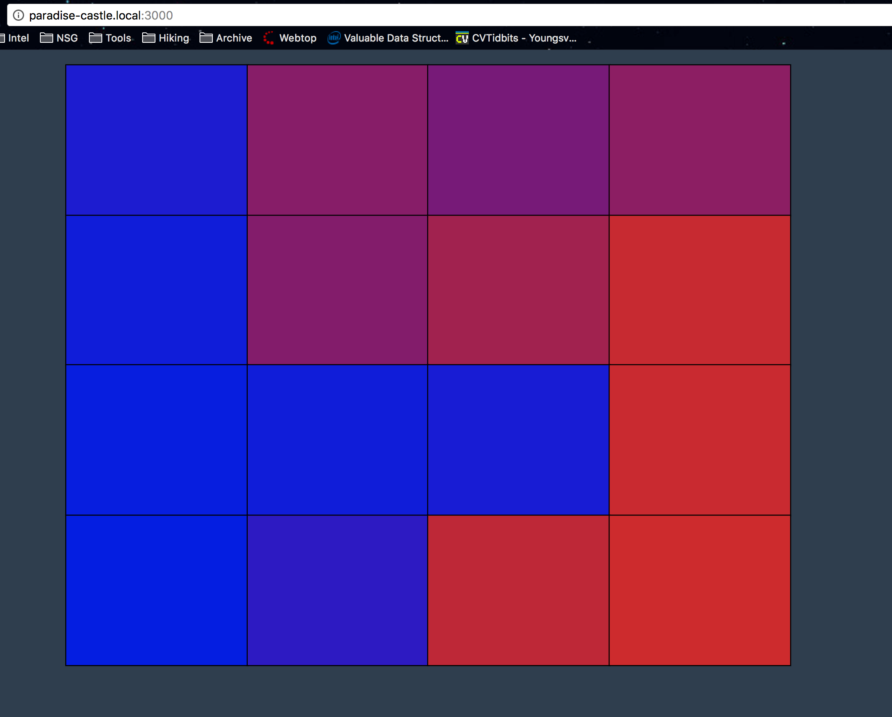

# Paradise Castle

## Getting Started

To run the example Omron D6T application, perform the following actions:

```
$ git clone https://github.com/jmromeo/paradise-castle
$ cd paradise-castle
$ npm install
$ cd bathroom
$ node app.js
```

Once you've gotten the app running, there are 2 options for connecting:
  <ul>
    <li> If running server on same device you would like to connect from, navigate to http://127.0.0.1:3000 </li>
    <li> If connecting to server from different device, replace 127.0.0.1 with the ip address of server (found using ifconfig) </li>
  </ul>

Here is a screenshot when I'm far away from the sensor.


Here is a screenshot when I'm standing near the sensor.

